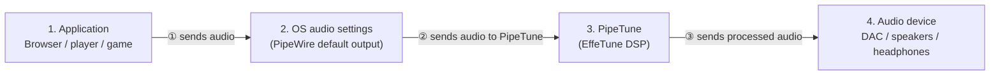
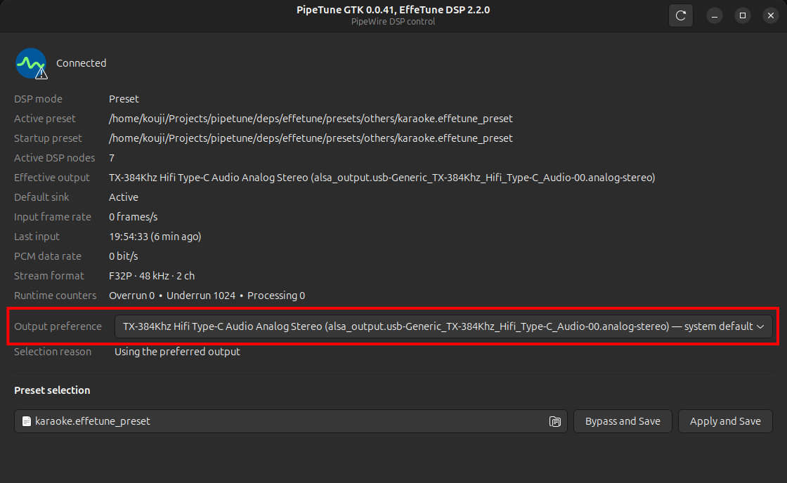
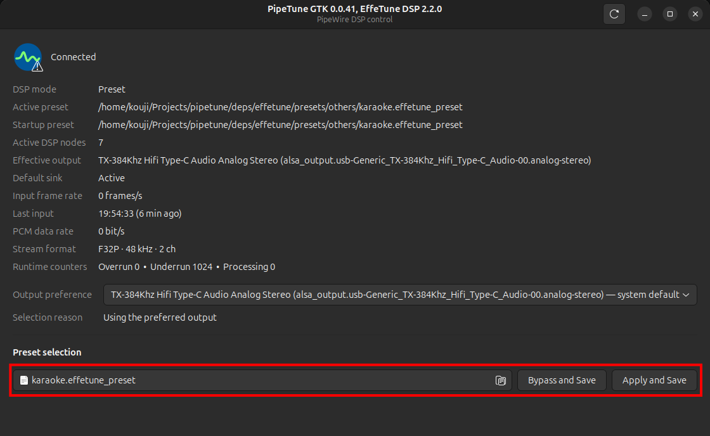

# PipeTune

Applies an EffeTune DSP preset to all audio in one Linux desktop session.


----

[(Japanese language is here/日本語はこちら)](./README_ja.md)

> Please note that this English version of the document was machine-translated and then partially edited, so it may contain inaccuracies.
> We welcome pull requests to correct any errors in the text.

## What Is This?

PipeTune applies an [EffeTune](https://github.com/Frieve-A/effetune) DSP preset
to all audio in one Linux desktop session.
It inserts a virtual PipeWire sink in front of the selected physical output and includes a GTK 3 control
application that remains available through the desktop system tray.

### Features

- Loads canonical and legacy EffeTune preset files with the
  `.effetune_preset` extension.
- Applies the enabled native EffeTune DSP pipeline to desktop audio.
- Lets the user choose a physical output from the CLI or GTK application.
- Falls back to the physical system default when the preferred output is
  unavailable, and returns automatically after hotplug.
- Changes presets without restarting the daemon.
- Starts safely in pass-through mode when no preset has been selected.
- Sets up or removes all per-user integration with one CLI command.
- Displays runtime state and audio error counters in the GTK application.
- Restores a physical default output when PipeTune stops.

The default stream format is 48 kHz stereo. PipeWire converts streams from
applications that use another format.

### Supported systems

PipeTune requires a PipeWire desktop session and systemd user services. A
standalone PulseAudio session is not supported.

Prebuilt Debian packages are published for:

| Distribution | Release | Architectures |
| --- | --- | --- |
| Debian | bookworm | amd64, i386, arm64, armhf |
| Debian | trixie | amd64, i386, arm64, armhf, riscv64 |
| Ubuntu | 24.04 | amd64, arm64 |
| Ubuntu | 26.04 | amd64, arm64 |

Use the following command if you are unsure which package architecture to
download:

```sh
dpkg --print-architecture
```

---

## Download and install

Download the `.deb` matching your distribution, release, and architecture
from the [PipeTune GitHub Releases page](https://github.com/kekyo/pipetune/releases/).

Open a terminal in the directory containing the downloaded package. Make sure
that directory contains only the intended PipeTune package, then install it
with:

```sh
sudo apt install ./pipetune-*.deb
```

`apt` installs the package and its required runtime dependencies.

To verify that the installation succeeded, run:

```sh
pipetune --version
```

## Initial setup

Since PipeTune runs as a user-level daemon, additional setup is required for each user after the package is installed.

Run setup as the regular desktop user, without `sudo`:

```sh
pipetune setup
```

`setup` reloads, enables, and restarts the systemd user service, verifies that
it is active, and then launches the PipeTune GTK application in the system tray.


From then on, the application appears there automatically.

## Audio streams and PipeTune

PipeTune acts as a virtual output device for the user session. It performs DSP
processing as defined by the EffeTune preset, then sends the processed audio to
the output device. The following diagram shows a simplified view of this flow:



- At step ②, the audio stream must be directed to PipeTune. Select PipeTune in
  the OS audio output device settings or an equivalent dialog.
- At step ③, PipeTune sends audio to the user's selected device when that
  device is available. While the selected device cannot be found—for example,
  while a USB device is unplugged—PipeTune automatically falls back to the
  system default and returns to the selected device when it is reconnected.

## Choosing PipeTune's output device

The user can explicitly choose the device used for step ③ in the previous
section.



The GTK window provides an **Output preference** drop-down. Its first item,
**System default**, clears an explicit preference. It also shows the effective
output and whether it was selected as the preference, the system default, or a
fallback.

The same operations are available from the CLI:

```sh
pipetune output list
pipetune output get
pipetune output select
pipetune output set alsa_output.example
pipetune output clear
```

These commands require the per-user daemon to be running. `output select`
offers a numbered menu in an interactive terminal. `output set` stores the
stable PipeWire `node.name`, including for a device that is temporarily
disconnected. `output clear` removes that preference.

With no preference, PipeTune follows the physical system default. If no audio
output exists at all, the daemon remains running and watches for hotplug, but
audio playback is unavailable until a device appears.

## Selecting an EffeTune preset

Users can select an EffeTune preset file in the GTK window:



- EffeTune preset files use the `.effetune_preset` extension.
- `Bypass and Save` ignores the preset file and passes the audio stream
  through without DSP processing.
- `Apply and Save` loads the selected preset file and starts processing audio
  with the EffeTune DSP engine.

The same operations are available from the CLI:

```sh
pipetune setup --preset /absolute/path/to/example.effetune_preset
pipetune bypass
```

## Update or remove PipeTune

To update PipeTune, download a newer matching package from
[GitHub Releases](https://github.com/kekyo/pipetune/releases) and install it
with the same `sudo apt install ./pipetune-*.deb` command.

Before removing the package, undo its per-user integration as the desktop user:

```sh
pipetune unsetup
sudo apt remove pipetune
```

`unsetup` quits the GTK application, disables and stops the user service,
restores a physical default output, and installs a user autostart mask so the
GTK application stays disabled. It preserves the startup selection. Use
`pipetune unsetup --purge` to also remove PipeTune's application
configuration.

If a custom user autostart entry must be masked, `unsetup` keeps it in a
PipeTune-managed backup. A later `pipetune setup` restores that backup instead
of overwriting it. Package removal alone does not delete per-user
configuration or autostart overrides.

## Logs and recovery

View daemon logs with:

```sh
journalctl --user -u pipetune.service
```

If a manually launched PipeTune process was terminated without restoring the
physical default output, recover it with:

```sh
pipetune --restore-default
```

---

## More information

- [Daemon operation and developer documentation](pipetune/README.md)
- [GTK application behavior](pipetune-gtk/README.md)

## License

Under MIT.
