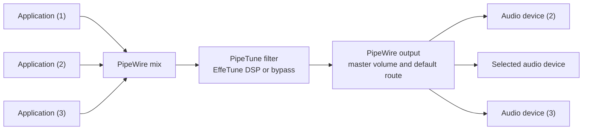

# PipeTune

Engine and User Interface for Applied EffeTune DSP on a Linux Desktop


[](https://www.repostatus.org/#active)
[](https://opensource.org/licenses/MIT)

---

[(Japanese language is here/日本語はこちら)](./README_ja.md)

> Please note that this English version of the document was machine-translated and then partially edited, so it may contain inaccuracies.
> We welcome pull requests to correct any errors in the text.

## What Is This?

PipeTune applies an [EffeTune](https://github.com/Frieve-A/effetune) DSP preset
to all audio in one Linux desktop session.

EffeTune DSP performs computations using fully natively compiled binaries.
On each platform, you can select native SIMD operations.

WirePlumber (PipeWire orchestrator) inserts PipeTune as a transparent filter between the mixed desktop
playback stream and the normal PipeWire output path. A GTK3 control
application remains available through the desktop system tray.


### Features

- You can load EffeTune preset files to apply a DSP pipeline to the audio output of the entire Linux system.
- Loads standard and legacy EffeTune preset files with the `.effetune_preset` extension
  and applies the DSP pipeline to desktop audio.
- Supports the EffeTune 2.7.0 native DSP contract, including direct runs with
  1 through 16 planar channels.
- Automatically negotiates the sampling rate with the PipeWire graph, or computes the DSP at specified rates of 44.1, 48, 96, 192, or 384 kHz.
- The DSP performs computations entirely in native code. You can choose between Scalar (for compatibility), automatic SIMD selection, or CPU-verified implementations for specific instruction sets.
- Automatically suspends DSP work after a selectable period of silent input while allowing effect tails to finish first.
- A GTK application that resides in the system tray allows you to manage various DSP states and settings.
- Operation is also possible via CLI commands.

### Supported systems

PipeTune requires a PipeWire desktop session managed by WirePlumber and
systemd user services. WirePlumber 0.4 and 0.5 are supported. A standalone

> Note: This applies to the standard Debian and Ubuntu distributions.
> It may also work on other distributions if they meet the system requirements.

Prebuilt Debian packages are published for:

| Distribution | Release | Architectures |
| :--- | :--- | :--- |
| Debian | bookworm | amd64, i386, arm64, armhf |
| Debian | trixie | amd64, i386, arm64, armhf, riscv64 |
| Ubuntu | 24.04 | amd64, arm64 |
| Ubuntu | 26.04 | amd64, arm64 |

---

## Download and install

Download the `.deb` matching your distribution, release, and architecture
from the [PipeTune GitHub Releases page](https://github.com/kekyo/pipetune/releases/).

Use the following command if you are unsure which package architecture to
download:

```sh
dpkg --print-architecture
```

Open a terminal in the directory containing the downloaded package. Make sure
that directory contains only the intended PipeTune package, then install it
with:

```sh
sudo apt install ./pipetune-*.deb
```

`apt` installs the package and its required runtime dependencies.

To verify that the installation succeeded, run:

```sh
pipetune --version
```

## Initial setup

Since PipeTune runs as a user-level daemon, setup is required once for each
desktop user after the package is installed. Double-clicking the PipeTune icon
in the GNOME application launcher, or launching it from another desktop
application menu, performs this setup automatically before the GTK application
connects to the daemon. This also covers a user launching PipeTune for the
first time when the package was installed earlier by someone else.

To perform the same setup explicitly, run this as the regular desktop user,
without `sudo`:

```sh
pipetune setup
```

`setup` checks the current user's managed files, setup version, and systemd
user service. If the integration is already current, it exits without
repeating setup. Otherwise it installs or repairs the integration and launches
PipeTune GTK in the system tray. Use `pipetune setup --force` (or the short
form `pipetune setup -f`) to repeat the setup operations unconditionally.

During an automatic first launch, the window displays setup progress and
keeps its controls read-only. If setup fails, PipeTune GTK opens the Action
Log with the diagnostic and sends a desktop notification when the window is
hidden. It still attempts to connect so an already-running daemon remains
usable.


Open the PipeTune settings window by double-clicking the system tray icon or
selecting `Open` from its menu.

## PipeTune settings window

The PipeTune settings window always displays PipeTune's status, divided into
sections, on the left, while the Processing, Rate, DSP, and Advanced settings
are shown on the right.


Changing a setting previews it immediately in the running daemon. The `Apply`
button confirms and saves the current state. The `Cancel` button, Escape, or
the title-bar close button restores the previous live state before hiding the
window.

The status pane on the left displays DSP utilization as a bar. The `Action Log`
drawer at the bottom lets you review the history of connections, previews,
saves, and failures.

Use the `Enable DSP processing` switch under `Processing` to easily turn DSP
processing on or off (bypass mode).

The `DSP` page can also suspend DSP work automatically after continuous
silent input. Its duration control accepts 0.1 through 5.0 seconds in 0.1
second steps.

If the PipeTune daemon cannot be reached, the UI controls become read-only and
normal operation resumes after reconnection.

## Audio streams and PipeTune

PipeTune uses PipeWire and WirePlumber on Linux to insert DSP processing into
the audio stream as a filter, as shown below:



Per-application volume is applied before mixing. In bypass mode, the mixed PCM
is passed downstream without invoking EffeTune. After the DSP filter, desktop
master-volume and output-device selection work exactly as they do without
PipeTune.

## Selecting an EffeTune DSP preset

When loading an EffeTune DSP preset into PipeTune, you can select from:

- EffeTune's standard DSP presets
- User presets saved by EffeTune for Linux AppImage
- An individual `*.effetune_preset` file

The user preset file saved by the Linux AppImage is located at
`$XDG_CONFIG_HOME/effetune/effetune_presets.json` (or
`~/.config/effetune/effetune_presets.json`).

Select a preset from the list or specify a file to preview it immediately in
the DSP.

While preset processing is active, PipeTune monitors the file used by the DSP.
An in-place edit or atomic replacement is loaded automatically. The new
pipeline is built completely before activation; if reading, parsing, or DSP
construction fails, the currently running pipeline remains active and the
error is shown in runtime status. A later valid update is retried
automatically. When the active choice is a preset saved by EffeTune, the
settings application refreshes its private standalone snapshot after the
corresponding entry changes, which triggers the same daemon-side reload.

From the CLI, you can specify either a preset file path or bypass mode:

```sh
pipetune setup --preset /absolute/path/to/example.effetune_preset
pipetune bypass
```

## Choosing the PCM rate

Configure the rate using `DSP sampling frequency` and `PipeWire enforcement`
in the PipeTune settings window. `Automatic` follows the rate negotiated by the
PipeWire graph. A fixed setting requests `44.1`, `48`, `96`, `192`, or `384`
kHz for both filter nodes and the EffeTune engine. The status display shows the
actual DSP and graph rates.

- `Suggest` proposes the graph rate to PipeWire. PipeWire may accept it or
  choose a different graph rate to accommodate the audio streams.
- `Force` additionally asks PipeWire to maintain that rate.

Neither mode changes PipeWire's global clock configuration.

If the requested value cannot be applied, PipeTune remains connected and
continues DSP processing at the graph rate that was actually negotiated. An
unsuccessful `Force` request appears in the Rate diagnostics.

The same information and controls are available from the CLI:

```sh
pipetune rate list
pipetune rate get
pipetune rate set automatic
pipetune rate set 192000 force
```

`rate list` lists `Automatic` and the five fixed rates. `rate get` reports the
configured policy and negotiated rates. While connected to the daemon,
`rate set` applies the change immediately and saves it only after the daemon
confirms success. If the daemon is unavailable, the setting is saved for its
next start.

Changing the rate may cause a brief period of silence while PipeTune rebuilds
the DSP and PipeWire streams.

## Choosing the native DSP backend

PipeTune lets you choose which CPU instruction set is used to compute the
EffeTune DSP. Select it from `Native backend` on the `DSP` page of the PipeTune
settings window.

- `Scalar` is the compatibility-oriented default. It is intended to reproduce
  EffeTune's computations as faithfully as possible.
- `SIMD (Auto)` automatically selects the highest validated implementation
  supported by the CPU.
- The same drop-down can also pin `baseline`, `x86-64-v3`, `x86-64-v4`, or
  `Arm64 SVE` where available on the target architecture.

> Note: The original EffeTune performs its computations using WebAssembly and
> WebAssembly SIMD, whereas PipeTune uses native CPU instructions. Therefore,
> very small numerical differences from EffeTune may occur. The project owner
> could not hear any difference.

The same information and controls are available from the CLI:

```sh
pipetune dsp list
pipetune dsp get
pipetune dsp set scalar
pipetune dsp set simd
pipetune dsp set simd --variant x86-64-v3
```

While connected to the daemon, `dsp set` rebuilds the current preset pipeline
with the new backend and saves the setting only after the daemon confirms
success.

DSP internal state is reset, so a discontinuity or brief silence during the
switch is expected. If the daemon is unavailable, a locally validated choice
is saved for its next start. If the configured SIMD backend fails its CPU
requirements or library validation at startup, PipeTune falls back to an
available lower SIMD tier or Scalar and reports the actual variant and reason
in the status display.

## Suspending DSP during silence

Turn on `Suspend DSP on silence` on the `DSP` page to avoid continuing
EffeTune calculations when an application, such as a paused browser video,
keeps sending silent PCM. `Silence duration` selects 0.1 through 5.0 seconds
in 0.1 second steps. Turning the switch off selects `ignore`, which is the
default and keeps processing silent input as before. The last selected
duration remains visible while the switch is off and is reused when it is
turned on again; the first selection is 1.0 second.

PipeTune checks the PCM after input sample-rate conversion. During the
selected silent interval it continues running the complete preset, so delay,
reverb, and generated effect output can finish. It then fades the result to
zero over 5 ms, resets the DSP state, emits zero PCM, and stops invoking
EffeTune. The first block containing any nonzero sample wakes the DSP and is
processed immediately. Effects that generate sound from otherwise silent
input, such as vinyl-noise simulations, are also stopped after the selected
interval when this option is enabled.

The status pane keeps the preset processing mode unchanged and reports DSP
activity separately. While the silent interval is being processed it shows
`Draining`; after DSP work stops, the Load display shows `Suspended` instead
of a percentage.

The saved environment assignment is
`PIPETUNE_DSP_IDLE_TIMEOUT=ignore` or an integer number of milliseconds from
`100` through `5000` in `100` ms steps.

## Resetting PipeTune configuration

`Restore Defaults` on the `Advanced` page of the PipeTune settings window
previews the following state without saving it:

- DSP changes to bypass mode
- PCM rate is `Automatic` and the PipeWire request is `Suggest`
- Native DSP backend is `Scalar`
- Automatic DSP suspension is `Ignore`

Use `Apply` to save the defaults or `Cancel` to restore the previous live
settings. This GTK operation does not restart the service.

You can also reset the configuration from the CLI:

```sh
pipetune config reset
pipetune config reset --yes
```

Without `--yes` (or `-y`), the CLI asks for confirmation. The configuration
file is completely replaced, so this command can also recover from a corrupted
configuration file.

A running user service is restarted immediately; a stopped service remains
stopped.

## Update or remove PipeTune

To update PipeTune, download a newer matching package from
[GitHub Releases](https://github.com/kekyo/pipetune/releases/) and install it
with the same `sudo apt install ./pipetune-*.deb` command.

Then launch PipeTune from the desktop application menu. It detects the updated
setup version and applies any required per-user changes. The equivalent manual
command is `pipetune setup` as the regular desktop user.

Before removing the package, undo its per-user integration as the desktop user:

```sh
pipetune unsetup
sudo apt remove pipetune
```

`pipetune unsetup` quits the GTK application, disables and stops the user
service, and removes PipeTune's WirePlumber configuration. It also creates a
per-user autostart mask to prevent the GTK application from starting
automatically. The startup preset selection is preserved.

Use `pipetune unsetup --purge` to also remove PipeTune's application
configuration.

## Logs

View daemon logs with:

```sh
journalctl --user -u pipetune.service
```

---

## More information

- [Daemon operation and developer documentation](pipetune/README.md)
- [GTK application behavior](pipetune-gtk/README.md)
- [Native DSP backends and benchmarking](pipetune/docs/dsp-backends.md)

## Limitations

FIR Crossover, 5Band FIR PEQ, Group Delay EQ, and Group Delay PEQ are
supported. PipeTune regenerates their convolution coefficients from the preset
parameters and the active sample rate. FIR Crossover requires an even output
bus from 4 through 16 channels and is omitted with a warning on other layouts.

Room EQ and IR Reverb remain unsupported. A Room EQ preset references
measurement data that EffeTune resolves through its
[measurement store](https://github.com/Frieve-A/effetune/blob/bedc6c662a6edc88c9644b7e00cec9122a250cfb/js/measurement-store/client.js#L71),
and IR Reverb resolves a content identifier through its
[IR library](https://github.com/Frieve-A/effetune/blob/bedc6c662a6edc88c9644b7e00cec9122a250cfb/plugins/reverb/ir_reverb.js#L766-L802).
The required PCM is not contained in `.effetune_preset`, so PipeTune omits
these nodes with warnings.

## License

Under MIT.
