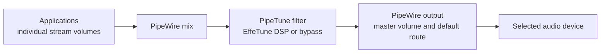

# PipeTune

Applies an EffeTune DSP preset to all audio in one Linux desktop session.


[](https://www.repostatus.org/#active)
[](https://opensource.org/licenses/MIT)

---

[(Japanese language is here/日本語はこちら)](./README_ja.md)

> Please note that this English version of the document was machine-translated and then partially edited, so it may contain inaccuracies.
> We welcome pull requests to correct any errors in the text.

## What Is This?

PipeTune applies an [EffeTune](https://github.com/Frieve-A/effetune) DSP preset
to all audio in one Linux desktop session.
WirePlumber inserts PipeTune as a transparent filter between the mixed desktop
playback stream and the normal PipeWire output path. A GTK 3 control
application remains available through the desktop system tray.


### Features

- Loads canonical and legacy EffeTune preset files with the
  `.effetune_preset` extension.
- Applies the enabled native EffeTune DSP pipeline to desktop audio.
- Keeps desktop output-device and master-volume selection under ordinary
  PipeWire and WirePlumber policy.
- Follows the negotiated PipeWire graph rate or requests an explicit 44.1,
  48, 96, 192, or 384 kHz rate.
- Selects the scalar compatibility DSP backend, automatic SIMD dispatch, or a CPU-validated ISA tier from the CLI or GTK application.
- Sets up or removes all per-user integration with one CLI command.
- Displays runtime state in the GTK application.

### Supported systems

PipeTune requires a PipeWire desktop session managed by WirePlumber and
systemd user services. WirePlumber 0.4 and 0.5 are supported. A standalone
PulseAudio session is not supported.

Prebuilt Debian packages are published for:

| Distribution | Release | Architectures |
| --- | --- | --- |
| Debian | bookworm | amd64, i386, arm64, armhf |
| Debian | trixie | amd64, i386, arm64, armhf, riscv64 |
| Ubuntu | 24.04 | amd64, arm64 |
| Ubuntu | 26.04 | amd64, arm64 |

Use the following command if you are unsure which package architecture to
download:

```sh
dpkg --print-architecture
```

---

## Download and install

Download the `.deb` matching your distribution, release, and architecture
from the [PipeTune GitHub Releases page](https://github.com/kekyo/pipetune/releases/).

Open a terminal in the directory containing the downloaded package. Make sure
that directory contains only the intended PipeTune package, then install it
with:

```sh
sudo apt install ./pipetune-*.deb
```

`apt` installs the package and its required runtime dependencies.

To verify that the installation succeeded, run:

```sh
pipetune --version
```

## Initial setup

Since PipeTune runs as a user-level daemon, additional setup is required for each user after the package is installed.

Run setup as the regular desktop user, without `sudo`:

```sh
pipetune setup
```

`setup` reloads, enables, and restarts the systemd user service, verifies that
it is active, and then launches the PipeTune GTK application in the system
tray. It also installs the WirePlumber 0.4 compatibility files; WirePlumber 0.5
uses PipeTune's smart-filter properties directly.


Open the PipeTune settings window by double-clicking the system tray icon or
selecting **Open** from its menu.

## PipeTune settings window

The PipeTune settings window keeps the sectioned PipeTune status pane visible
on the left while Processing, Rate, DSP, and Advanced settings switch on the
right.


Changing a setting previews it immediately in the running daemon. The single
**Apply** button saves all daemon-confirmed choices as one atomic startup
snapshot; **Cancel**, Escape, or the title-bar close button restores the
previous live state before hiding the window.

The persistent pane presents DSP Load directly below the connection
summary, aligned with the summary's left edge so it remains clear of the
status icon. The responsive horizontal meter contains the current percentage.
Its graphical fill is capped at 100%, but the text continues to show measured
overload values above 100%.

The bottom **Action Log** drawer retains recent connection, preview,
persistence, and failure history. Settings become read-only while PipeTune is
disconnected and resume after reconnection.

## Audio streams and PipeTune

WirePlumber inserts PipeTune into the normal playback path. PipeWire mixes the
application streams first, PipeTune processes that mixed stream, and the
ordinary output-volume and device policy remains after the filter:



Per-application volume is applied before the mix. Bypass copies the mixed PCM
through without invoking EffeTune. After the filter, the desktop master volume
and selected output device work exactly as they do without PipeTune.

## System volume and output device

Choose speakers, headphones, HDMI, or another output in GNOME Settings or the
desktop's ordinary sound control. The same control adjusts the overall output
volume after PipeTune. PipeTune neither stores an output preference nor
changes the PipeWire default device, so its GTK window and CLI intentionally
have no output-device selector.

WirePlumber reconnects the filter output when the ordinary default device
changes or is hot-plugged. Applications remain routed through PipeTune without
selecting a PipeTune device in the sound control panel.

## Selecting an EffeTune DSP preset

When loading an EffeTune DSP preset into PipeTune, you can select from:

- EffeTune's standard DSP presets
- User presets saved by EffeTune for Linux AppImage
- An individual `*.effetune_preset` file

The user preset file saved by the Linux AppImage is located at
`$XDG_CONFIG_HOME/effetune/effetune_presets.json` (or
`~/.config/effetune/effetune_presets.json`).

Select a preset from the list or specify a file. The choice is loaded into the
DSP immediately as a live preview; click **Apply** to save the complete dialog
configuration. Turn off **Enable DSP processing** to preview bypass mode.
Cancel restores the previous live processing choice.

From the CLI, you can specify either a preset file path or bypass mode:

```sh
pipetune setup --preset /absolute/path/to/example.effetune_preset
pipetune bypass
```

## Choosing the PCM rate

The PipeTune settings window provides DSP sample rate and PipeWire enforcement
drop-downs. Automatic follows the rate negotiated by the PipeWire graph. A
fixed choice requests 44.1, 48, 96, 192, or 384 kHz for both filter nodes and
the EffeTune engine. Runtime status shows the active DSP and graph rates.

Suggest sets `node.rate` as a preference; PipeWire may negotiate another graph
rate. Force additionally asks PipeWire to hold the fixed rate while the filter
output is active. Neither mode changes PipeWire's global clock configuration.
If PipeWire cannot apply the request, PipeTune stays connected and runs DSP at
the negotiated graph rate. An unapplied Force request appears as a rate
diagnostic.

The same information and controls are available from the CLI:

```sh
pipetune rate list
pipetune rate get
pipetune rate set automatic
pipetune rate set 192000 force
```

`rate list` lists Automatic and the five fixed choices. `rate get` reports the
configured policy and negotiated rates. A connected `rate set` applies the
change immediately and saves it only after daemon confirmation. If the daemon
is unavailable, the policy is saved for its next start. A live change may
cause a short silent interval while PipeTune rebuilds the DSP and renegotiates
its filter streams.

## Choosing the native DSP backend

The PipeTune settings window's DSP page provides a **Native backend**
drop-down. **Scalar** is the compatibility default. **SIMD (Auto)** selects the
highest validated tier supported by the CPU. The same drop-down can pin the
architecture baseline, x86-64-v3, x86-64-v4, or Arm64 SVE tier where
applicable.

The same information and controls are available from the CLI:

```sh
pipetune dsp list
pipetune dsp get
pipetune dsp set scalar
pipetune dsp set simd
pipetune dsp set simd --variant x86-64-v3
```

A connected `dsp set` rebuilds and replaces the active preset pipeline, then
saves the choice only after daemon confirmation. DSP histories are reset, so
a discontinuity or brief silence is allowed. If the daemon is unavailable, a
valid local backend is saved for the next start. Configured SIMD falls back to
a lower SIMD tier or Scalar at startup when its CPU or library validation
fails, with the concrete effective tier and reason shown in status.

The effect depends strongly on the preset and the kinds of DSP operations it
uses.

## Resetting PipeTune configuration

The PipeTune settings window's Advanced page provides **Restore Defaults**. It
previews these choices live without saving them:

- DSP **Bypass**;
- PCM rate Automatic with Suggest; and
- native DSP backend **Scalar**, with SIMD preference **Auto**.

Click **Apply** to persist the defaults, or **Cancel** to restore the prior
live configuration. This GTK action does not restart the service. The CLI
reset below remains available for immediate configuration replacement and
service restart:

```sh
pipetune config reset
pipetune config reset --yes
```

Without `--yes` (or `-y`), the CLI asks for confirmation and accepts `y` or
`yes` case-insensitively. The command atomically replaces the shared
`environment` file, so it can recover from unsupported legacy lines. It does
not create a backup. A running `pipetune.service` is restarted immediately;
an inactive service remains inactive. If that restart fails, the command
reports a partial failure but keeps the reset configuration.

## Update or remove PipeTune

To update PipeTune, download a newer matching package from
[GitHub Releases](https://github.com/kekyo/pipetune/releases) and install it
with the same `sudo apt install ./pipetune-*.deb` command.

Before removing the package, undo its per-user integration as the desktop user:

```sh
pipetune unsetup
sudo apt remove pipetune
```

`unsetup` quits the GTK application, disables and stops the user service,
removes the WirePlumber 0.4 compatibility files, and installs a user
autostart mask so the GTK application stays disabled. It preserves the
startup selection. Use
`pipetune unsetup --purge` to also remove PipeTune's application
configuration.

If a custom user autostart entry must be masked, `unsetup` keeps it in a
PipeTune-managed backup. A later `pipetune setup` restores that backup instead
of overwriting it. Package removal alone does not delete per-user
configuration or autostart overrides.

## Logs

View daemon logs with:

```sh
journalctl --user -u pipetune.service
```

PipeTune does not own the default output, so stopping or crashing it requires
no output-device restoration. WirePlumber keeps ordinary output selection and
volume policy in effect.

---

## More information

- [Daemon operation and developer documentation](pipetune/README.md)
- [GTK application behavior](pipetune-gtk/README.md)
- [Native DSP backends and benchmarking](pipetune/docs/dsp-backends.md)

## Limitations

Room EQ and IR Reverb are not supported in the current version. Their required
assets are stored in EffeTune's IndexedDB and are not included in
`.effetune_preset` files, so PipeTune cannot load them.

## License

Under MIT.
