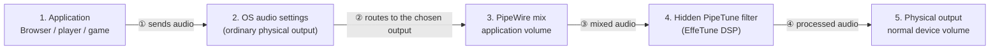

# PipeTune

Applies an EffeTune DSP preset to all audio in one Linux desktop session.


[](https://www.repostatus.org/#active)
[](https://opensource.org/licenses/MIT)

---

[(Japanese language is here/日本語はこちら)](./README_ja.md)

> Please note that this English version of the document was machine-translated and then partially edited, so it may contain inaccuracies.
> We welcome pull requests to correct any errors in the text.

## What Is This?

PipeTune applies an [EffeTune](https://github.com/Frieve-A/effetune) DSP preset
to all audio in one Linux desktop session.
WirePlumber inserts its hidden DSP filters immediately before the physical
outputs selected in the normal desktop sound settings. PipeTune also includes
a GTK 3 control application that remains available through the desktop system
tray.


### Features

- Loads canonical and legacy EffeTune preset files with the
  `.effetune_preset` extension.
- Applies the enabled native EffeTune DSP pipeline to desktop audio.
- Keeps physical output selection and volume control in the desktop's normal
  sound settings; no PipeTune device is shown there.
- Runs an independent filter at each output's maximum supported rate or at an
  explicit 44.1, 48, 96, 192, or 384 kHz rate.
- Selects its WirePlumber 0.4 or 0.5 policy at runtime from one package and one
  PipeTune binary.
- Selects the scalar compatibility DSP backend, automatic SIMD dispatch, or a CPU-validated ISA tier from the CLI or GTK application.
- Sets up or removes all per-user integration with one CLI command.
- Displays runtime state in the GTK application.

### Supported systems

PipeTune requires a PipeWire desktop session and systemd user services. A
standalone PulseAudio session is not supported.

Prebuilt Debian packages are published for:

| Distribution | Release | Architectures |
| --- | --- | --- |
| Debian | bookworm | amd64, i386, arm64, armhf |
| Debian | trixie | amd64, i386, arm64, armhf, riscv64 |
| Ubuntu | 24.04 | amd64, arm64 |
| Ubuntu | 26.04 | amd64, arm64 |

Use the following command if you are unsure which package architecture to
download:

```sh
dpkg --print-architecture
```

---

## Download and install

Download the `.deb` matching your distribution, release, and architecture
from the [PipeTune GitHub Releases page](https://github.com/kekyo/pipetune/releases/).

Open a terminal in the directory containing the downloaded package. Make sure
that directory contains only the intended PipeTune package, then install it
with:

```sh
sudo apt install ./pipetune-*.deb
```

`apt` installs the package and its required runtime dependencies.

To verify that the installation succeeded, run:

```sh
pipetune --version
```

## Initial setup

Since PipeTune runs as a user-level daemon, additional setup is required for each user after the package is installed.

Run setup as the regular desktop user, without `sudo`:

```sh
pipetune setup
```

`setup` reloads the installed WirePlumber policy when WirePlumber is already
running, enables and restarts the PipeTune systemd user service, verifies that
it is active, and then launches the GTK application in the system tray.


Open the PipeTune settings window by double-clicking the system tray icon or
selecting **Open** from its menu.

## PipeTune settings window

The PipeTune settings window keeps the sectioned PipeTune status pane visible
on the left while **Processing**, **Rate**, **DSP**, and **Advanced** settings
switch on the right.


Changing a setting previews it immediately in the running daemon. The single
**Apply** button saves all daemon-confirmed choices as one atomic startup
snapshot; **Cancel**, Escape, or the title-bar close button restores the
previous live state before hiding the window.

The persistent pane presents DSP **Load** directly below the connection
summary, aligned with the summary's left edge so it remains clear of the
status icon. The responsive horizontal meter contains the current percentage.
Its graphical fill is capped at 100%, but the text continues to show measured
overload values above 100%.

The bottom **Action Log** drawer retains recent connection, preview,
persistence, and failure history. Settings become read-only while PipeTune is
disconnected and resume after reconnection.

## Audio streams and PipeTune

Applications and the desktop continue to target ordinary physical outputs.
WirePlumber transparently inserts the ready PipeTune filter assigned to that
output. Per-application volume is applied before the filter and the physical
output's normal volume remains the final gain stage:



The hidden filter nodes are denied to ordinary desktop clients, so they do not
appear as selectable devices. The OS output selector, default-output behavior,
per-application routing, mute, and volume therefore work as they did before
PipeTune was installed.

PipeTune maintains one independent filter runtime per eligible local physical
output. A new or reconnected output gets its own filter automatically. While a
filter is starting, unsupported, or has failed, WirePlumber leaves that output
on its direct route instead of making audio depend on a broken DSP path. The
status pane shows each output as active, waiting, direct, or failed.

## Selecting an EffeTune DSP preset

When loading an EffeTune DSP preset into PipeTune, you can select from:

- EffeTune's standard DSP presets
- User presets saved by EffeTune for Linux AppImage
- An individual `*.effetune_preset` file

The user preset file saved by the Linux AppImage is located at
`$XDG_CONFIG_HOME/effetune/effetune_presets.json` (or
`~/.config/effetune/effetune_presets.json`).

Select a preset from the list or specify a file. The choice is loaded into the
DSP immediately as a live preview; click **Apply** to save the complete dialog
configuration. Turn off **Enable DSP processing** to preview bypass mode.
Cancel restores the previous live processing choice.

From the CLI, you can specify either a preset file path or bypass mode:

```sh
pipetune setup --preset /absolute/path/to/example.effetune_preset
pipetune bypass
```

## Choosing the PCM rate

The PipeTune settings window provides **DSP rate** and
**PipeWire request** drop-downs. **Max** independently follows the highest of
44.1, 48, 96, 192, and 384 kHz supported by each output. Each fixed-rate row
says whether every output supports the rate or whether one requires
resampling. The **Effective rates** row shows, for every output:

- the input and EffeTune DSP rate;
- its resolved PipeWire output-graph rate;
- the active physical-device rate, or `idle`; and
- whether PipeWire resampling is required.

A fixed rate always remains each filter's DSP rate. If an output does not support it,
PipeTune selects the greatest supported output rate not above it, or the
device's minimum rate when none is below it. PipeWire performs the conversion
between those rates.

**Suggest** sets `node.rate` as a preference; PipeWire may choose another graph
rate. **Force** additionally asks PipeWire to hold that rate while PipeTune's
playback node is active. Neither mode changes PipeWire's global clock
configuration.

The same information and controls are available from the CLI:

```sh
pipetune rate list
pipetune rate get
pipetune rate set max suggest
pipetune rate set 192000 force
```

`rate list` reports support for all five selectable rates on every available
output. `rate get` reports the configured policy and final rates. A connected
`rate set` applies the change immediately and saves it only after daemon
confirmation. If the daemon is unavailable, the policy is saved for its next
start. A live change may cause a short silent interval while PipeTune rebuilds
the DSP and renegotiates its PipeWire streams.

## Choosing the native DSP backend

The PipeTune settings window's DSP page provides a **Native backend**
drop-down. **Scalar** is the compatibility default. **SIMD (Auto)** selects the
highest validated tier supported by the CPU. The same drop-down can pin the
architecture baseline, x86-64-v3, x86-64-v4, or Arm64 SVE tier where
applicable.

The same information and controls are available from the CLI:

```sh
pipetune dsp list
pipetune dsp get
pipetune dsp set scalar
pipetune dsp set simd
pipetune dsp set simd --variant x86-64-v3
```

A connected `dsp set` rebuilds and replaces the active preset pipeline, then
saves the choice only after daemon confirmation. DSP histories are reset, so
a discontinuity or brief silence is allowed. If the daemon is unavailable, a
valid local backend is saved for the next start. Configured SIMD falls back to
a lower SIMD tier or Scalar at startup when its CPU or library validation
fails, with the concrete effective tier and reason shown in status.

The effect depends strongly on the preset and the kinds of DSP operations it
uses.

## Resetting PipeTune configuration

The PipeTune settings window's Advanced page provides **Restore Defaults**. It
previews these choices live without saving them:

- DSP **Bypass**;
- the physical **System default** output;
- PCM rate **Max** with **Suggest**; and
- native DSP backend **Scalar**, with SIMD preference **Auto**.

Click **Apply** to persist the defaults, or **Cancel** to restore the prior
live configuration. With a valid connected configuration this GTK action does
not restart the service. The button remains clickable when the environment
file is invalid or live editing is unavailable; in that recovery state it
uses the same immediate configuration replacement and service restart as the
CLI below:

```sh
pipetune config reset
pipetune config reset --yes
```

Without `--yes` (or `-y`), the CLI asks for confirmation and accepts `y` or
`yes` case-insensitively. The command atomically replaces the shared
`environment` file, so it can recover from unsupported legacy lines. It does
not create a backup. A running `pipetune.service` is restarted immediately;
an inactive service remains inactive. If that restart fails, the command
reports a partial failure but keeps the reset configuration.

## Update or remove PipeTune

To update PipeTune, download a newer matching package from
[GitHub Releases](https://github.com/kekyo/pipetune/releases) and install it
with the same `sudo apt install ./pipetune-*.deb` command.

Before removing the package, undo its per-user integration as the desktop user:

```sh
pipetune unsetup
sudo apt remove pipetune
```

`unsetup` quits the GTK application, disables and stops the user service,
and installs a user autostart mask so the GTK application stays disabled.
Physical output selection is never owned by PipeTune and needs no restoration.
The command preserves the startup selection. Use
`pipetune unsetup --purge` to also remove PipeTune's application
configuration.

If a custom user autostart entry must be masked, `unsetup` keeps it in a
PipeTune-managed backup. A later `pipetune setup` restores that backup instead
of overwriting it. Package removal alone does not delete per-user
configuration or autostart overrides.

## Logs and recovery

View daemon logs with:

```sh
journalctl --user -u pipetune.service
```

If PipeTune stops unexpectedly, WirePlumber restores direct application routes
as the hidden filter nodes disappear. The physical output and its volume remain
unchanged.

---

## More information

- [Daemon operation and developer documentation](pipetune/README.md)
- [GTK application behavior](pipetune-gtk/README.md)
- [Native DSP backends and benchmarking](pipetune/docs/dsp-backends.md)

## Limitations

Room EQ and IR Reverb are not supported in the current version. Their required
assets are stored in EffeTune's IndexedDB and are not included in
`.effetune_preset` files, so PipeTune cannot load them.

## License

Under MIT.
