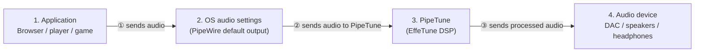

# PipeTune

Applies an EffeTune DSP preset to all audio in one Linux desktop session.


----

[(Japanese language is here/日本語はこちら)](./README_ja.md)

> Please note that this English version of the document was machine-translated and then partially edited, so it may contain inaccuracies.
> We welcome pull requests to correct any errors in the text.

## What Is This?

PipeTune applies an [EffeTune](https://github.com/Frieve-A/effetune) DSP preset
to all audio in one Linux desktop session.
It inserts a virtual PipeWire sink in front of the selected physical output and includes a GTK 3 control
application that remains available through the desktop system tray.

### Features

- Loads canonical and legacy EffeTune preset files with the
  `.effetune_preset` extension.
- Applies the enabled native EffeTune DSP pipeline to desktop audio.
- Lets the user choose a physical output from the CLI or GTK application.
- Falls back to the physical system default when the preferred output is
  unavailable, and returns automatically after hotplug.
- Runs the DSP at the selected output's maximum supported rate or at an
  explicit 44.1, 48, 96, 192, or 384 kHz rate.
- Shows output-device rate support and the final DSP, graph, and active
  physical rates in the CLI and GTK application.
- Selects the scalar compatibility DSP backend, automatic SIMD dispatch, or a
  CPU-validated ISA tier from the CLI or GTK application.
- Pauses with the PipeWire graph when possible and skips native DSP work after
  sustained exact-zero input and a settled effect tail.
- Changes presets without restarting the daemon.
- Starts safely in pass-through mode when no preset has been selected.
- Sets up or removes all per-user integration with one CLI command.
- Displays runtime state and audio error counters in the GTK application.
- Restores a physical default output when PipeTune stops.

The default PCM policy is **Max** with a PipeWire **suggest** request. PipeTune
therefore uses the highest user-selectable rate reported by the selected
output instead of imposing a fixed 48 kHz stream. PipeWire converts application
streams and, when necessary, resamples between PipeTune's DSP rate and a
device-compatible output rate.

### Supported systems

PipeTune requires a PipeWire desktop session and systemd user services. A
standalone PulseAudio session is not supported.

Prebuilt Debian packages are published for:

| Distribution | Release | Architectures |
| --- | --- | --- |
| Debian | bookworm | amd64, i386, arm64, armhf |
| Debian | trixie | amd64, i386, arm64, armhf, riscv64 |
| Ubuntu | 24.04 | amd64, arm64 |
| Ubuntu | 26.04 | amd64, arm64 |

Use the following command if you are unsure which package architecture to
download:

```sh
dpkg --print-architecture
```

---

## Download and install

Download the `.deb` matching your distribution, release, and architecture
from the [PipeTune GitHub Releases page](https://github.com/kekyo/pipetune/releases/).

Open a terminal in the directory containing the downloaded package. Make sure
that directory contains only the intended PipeTune package, then install it
with:

```sh
sudo apt install ./pipetune-*.deb
```

`apt` installs the package and its required runtime dependencies.

To verify that the installation succeeded, run:

```sh
pipetune --version
```

## Initial setup

Since PipeTune runs as a user-level daemon, additional setup is required for each user after the package is installed.

Run setup as the regular desktop user, without `sudo`:

```sh
pipetune setup
```

`setup` reloads, enables, and restarts the systemd user service, verifies that
it is active, and then launches the PipeTune GTK application in the system tray.


From then on, the application appears there automatically.

## Audio streams and PipeTune

PipeTune acts as a virtual output device for the user session. It performs DSP
processing as defined by the EffeTune preset, then sends the processed audio to
the output device. The following diagram shows a simplified view of this flow:



- At step ②, the audio stream must be directed to PipeTune. Select PipeTune in
  the OS audio output device settings or an equivalent dialog.
- At step ③, PipeTune sends audio to the user's selected device when that
  device is available. While the selected device cannot be found—for example,
  while a USB device is unplugged—PipeTune automatically falls back to the
  system default and returns to the selected device when it is reconnected.

## Choosing PipeTune's output device

The user can explicitly choose the device used for step ③ in the previous
section.


The GTK window provides an **Output preference** drop-down. Its first item,
**System default**, clears an explicit preference. It also shows the effective
output and whether it was selected as the preference, the system default, or a
fallback.

The same operations are available from the CLI:

```sh
pipetune output list
pipetune output get
pipetune output select
pipetune output set alsa_output.example
pipetune output clear
```

These commands require the per-user daemon to be running. `output select`
offers a numbered menu in an interactive terminal. `output set` stores the
stable PipeWire `node.name`, including for a device that is temporarily
disconnected. `output clear` removes that preference.

With no preference, PipeTune follows the physical system default. If no audio
output exists at all, the daemon remains running and watches for hotplug, but
audio playback is unavailable until a device appears.

## Choosing the PCM rate

The GTK window provides **DSP rate** and **PipeWire request** drop-downs.
**Max** follows the highest of 44.1, 48, 96, 192, and 384 kHz supported by the
selected output. Each fixed-rate row says whether that output supports the
rate. The **Effective rates** row shows:

- the input and EffeTune DSP rate;
- the selected PipeWire output-graph rate;
- the active physical-device rate, or `idle`; and
- whether PipeWire resampling is required.

A fixed rate always remains the DSP rate. If the output does not support it,
PipeTune selects the greatest supported output rate not above it, or the
device's minimum rate when none is below it. PipeWire performs the conversion
between those rates.

**Suggest** sets `node.rate` as a preference; PipeWire may choose another graph
rate. **Force** additionally asks PipeWire to hold that rate while PipeTune's
playback node is active. Neither mode changes PipeWire's global clock
configuration.

The same information and controls are available from the CLI:

```sh
pipetune rate list
pipetune rate get
pipetune rate set max suggest
pipetune rate set 192000 force
```

`rate list` reports support for all five selectable rates on every available
output. `rate get` reports the configured policy and final rates. A connected
`rate set` applies the change immediately and saves it only after daemon
confirmation. If the daemon is unavailable, the policy is saved for its next
start. A live change may cause a short silent interval while PipeTune rebuilds
the DSP and renegotiates its PipeWire streams.

## Choosing the native DSP backend

The GTK window's **DSP backend** section provides a **Native engine**
drop-down. **Scalar** is the compatibility default. **SIMD (Auto)** selects
the highest validated tier supported by the CPU. The same drop-down can pin
the architecture baseline, x86-64-v3, x86-64-v4, or Arm64 SVE tier where
applicable.

The same information and controls are available from the CLI:

```sh
pipetune dsp list
pipetune dsp get
pipetune dsp set scalar
pipetune dsp set simd
pipetune dsp set simd --variant x86-64-v3
```

A connected `dsp set` rebuilds and replaces the active preset pipeline, then
saves the choice only after daemon confirmation. DSP histories are reset, so
a discontinuity or brief silence is allowed. If the daemon is unavailable, a
valid local backend is saved for the next start. Configured SIMD falls back to
a lower SIMD tier or Scalar at startup when its CPU or library validation
fails, with the concrete effective tier and reason shown in status.

Expected gains depend strongly on the preset. The standard
`visualize/all_analyzers` preset directly exercises PFFFT (including its SIMD
implementation on x86 and Arm), while multi-instance pitch-shifting and
multiband presets are useful GCC auto-vectorization candidates. See the
[DSP backend and benchmark notes](pipetune/docs/dsp-backends.md) for the
architecture matrix and measurement procedure.

## Reducing idle DSP work

PipeTune combines PipeWire graph idling, preservation of PipeWire EMPTY/GAP
information, and DSP sleep based on monitoring exact-zero input.

When an application that is not producing any sound continues to send a
zero-PCM stream, DSP computation otherwise continues and keeps consuming CPU.
Applications that send zero PCM while inactive are common. Even a single such
process in a user session can keep PipeTune's DSP computation running,
increasing system temperatures and contributing to battery drain.

PipeTune monitors the input PCM stream. Once the configured zero-PCM idle
condition is satisfied, it stops DSP computation and waits until nonzero PCM
data is detected again.

The GTK window's **DSP idle** section displays the runtime state, cumulative
skipped frames, sleep transitions, and whether both PipeWire streams are
paused. Its policy selector provides:

- **Conservative** (default): after five seconds of exact-zero input, sleep
  once the final DSP output has remained at or below -150 dBFS for one second;
  and
- **Exact**: use the same input interval but require one second of
  mathematically exact-zero DSP output.

The same operations are available from the CLI:

```sh
pipetune idle get
pipetune idle get --json
pipetune idle set conservative
pipetune idle set exact
```

Any nonzero input wakes DSP processing in the same callback block. Before
sleeping, PipeTune performs a real-time-safe reset of every active EffeTune
kernel so stale delay, feedback, and telemetry state cannot leak into the next
sound. Exact mode avoids truncating any nonzero tail, but effects that generate
noise or never converge to exact zero may remain active.

When both PipeWire streams pause, PipeTune clears already queued audio and
flushes both stream queues. The DSP is reset by the first resumed capture
callback, and playback emits GAP if it resumes before fresh capture data, so
PCM from the previous playback interval is not replayed.

See the [DSP and PipeWire idling notes](pipetune/docs/dsp-idle.md) for the
complete state machine and EMPTY/GAP behavior.

## Resetting PipeTune configuration

The GTK window's **Configuration** section provides **Reset Configuration…**.
After confirmation, it resets every saved PipeTune choice to:

- DSP **Bypass**;
- the physical **System default** output;
- PCM rate **Max** with **Suggest**;
- native DSP backend **Scalar**, with SIMD preference **Auto**; and
- DSP idle policy **Conservative**.

The same reset is available from the CLI:

```sh
pipetune config reset
pipetune config reset --yes
```

Without `--yes` (or `-y`), the CLI asks for confirmation and accepts `y` or
`yes` case-insensitively. The command atomically replaces the shared
`environment` file, so it can recover from unsupported legacy lines. It does
not create a backup. A running `pipetune.service` is restarted immediately;
an inactive service remains inactive. If that restart fails, the command
reports a partial failure but keeps the reset configuration.

## Selecting an EffeTune DSP preset

When loading an EffeTune DSP preset into PipeTune, you can select from:

- EffeTune's standard DSP presets
- User presets saved by EffeTune for Linux AppImage
- An individual `*.effetune_preset` file

The user preset file saved by the Linux AppImage is located at
`$XDG_CONFIG_HOME/effetune/effetune_presets.json` (or
`~/.config/effetune/effetune_presets.json`).

Select a preset from the list or specify a file, then click
`Apply and Save` to load the preset into the DSP and start processing with the
EffeTune DSP engine. `Bypass and Save` ignores the preset file and bypasses
the audio stream without DSP processing.

From the CLI, you can specify either a preset file path or bypass mode:

```sh
pipetune setup --preset /absolute/path/to/example.effetune_preset
pipetune bypass
```

## Update or remove PipeTune

To update PipeTune, download a newer matching package from
[GitHub Releases](https://github.com/kekyo/pipetune/releases) and install it
with the same `sudo apt install ./pipetune-*.deb` command.

Before removing the package, undo its per-user integration as the desktop user:

```sh
pipetune unsetup
sudo apt remove pipetune
```

`unsetup` quits the GTK application, disables and stops the user service,
restores a physical default output, and installs a user autostart mask so the
GTK application stays disabled. It preserves the startup selection. Use
`pipetune unsetup --purge` to also remove PipeTune's application
configuration.

If a custom user autostart entry must be masked, `unsetup` keeps it in a
PipeTune-managed backup. A later `pipetune setup` restores that backup instead
of overwriting it. Package removal alone does not delete per-user
configuration or autostart overrides.

## Logs and recovery

View daemon logs with:

```sh
journalctl --user -u pipetune.service
```

If a manually launched PipeTune process was terminated without restoring the
physical default output, recover it with:

```sh
pipetune --restore-default
```

---

## More information

- [Daemon operation and developer documentation](pipetune/README.md)
- [GTK application behavior](pipetune-gtk/README.md)
- [Native DSP backends and benchmarking](pipetune/docs/dsp-backends.md)

## Limitations

Room EQ and IR Reverb are not supported in the current version. Their required
assets are stored in EffeTune's IndexedDB and are not included in
`.effetune_preset` files, so PipeTune cannot load them.

## License

Under MIT.
