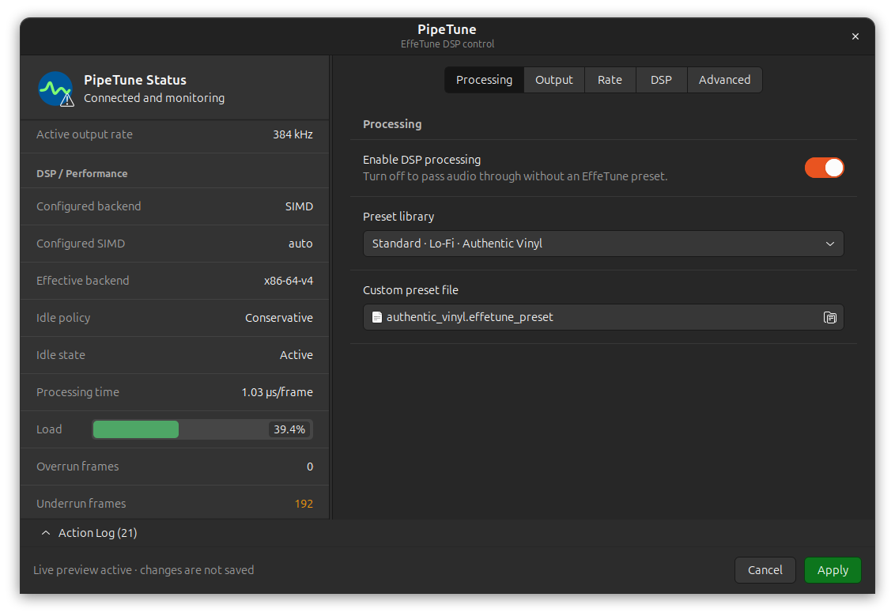
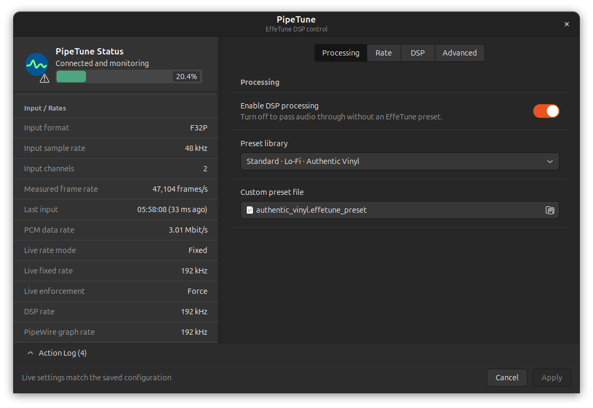
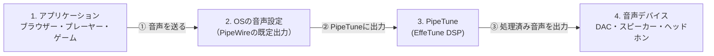
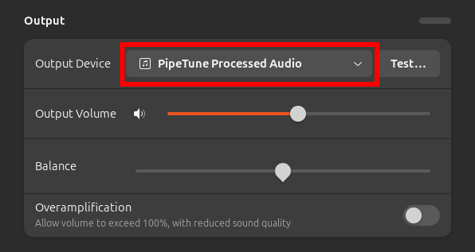

# PipeTune

Linuxのデスクトップセッションの音声に、EffeTuneで構築したDSPプリセットを適用


----

[(English language is here)](./README.md)

## これは何?

PipeTuneは、Linuxのデスクトップセッションの音声に
[EffeTune](https://github.com/Frieve-A/effetune) で構築したDSPプリセットを適用します。

選択した音声出力デバイスの手前に、仮想PipeWireシンクを挿入して実現します。
また、デスクトップのシステムトレイに常駐するGTK 3コントロールアプリケーションを提供します。



### 機能

- `.effetune_preset`拡張子の標準形式および旧形式のEffeTuneプリセットファイルを
  読み込みます。
- 有効なEffeTuneネイティブDSPパイプラインをデスクトップ音声へ適用します。
- CLIまたはGTKアプリケーションから物理出力を選択できます。
- 選択した出力の最大対応周波数、または44.1、48、96、192、384 kHzの指定周波数でDSPを計算します。
- 互換性重視のScalar、SIMD自動選択、CPU検証済みの命令セット別実装を選択できます。
- CLIコマンド1つで、ユーザーごとの設定または解除を行えます。
- GTKアプリケーションに実行状態を表示します。

### 対応システム

PipeTuneには、PipeWireデスクトップセッションとsystemdユーザーサービスが必要です。
単独のPulseAudioセッションには対応していません。

ビルド済みDebianパッケージは、次の環境向けに公開しています。

| ディストリビューション | リリース | アーキテクチャ |
| --- | --- | --- |
| Debian | bookworm | amd64, i386, arm64, armhf |
| Debian | trixie | amd64, i386, arm64, armhf, riscv64 |
| Ubuntu | 24.04 | amd64, arm64 |
| Ubuntu | 26.04 | amd64, arm64 |

ダウンロードするパッケージのアーキテクチャが分からない場合は、次のコマンドで
確認できます。

```sh
dpkg --print-architecture
```

---

## ダウンロードとインストール

[PipeTuneのGitHub Releasesページ](https://github.com/kekyo/pipetune/releases/) から、
使用するディストリビューション、リリース、アーキテクチャに合う`.deb`をダウンロードしてください。

ダウンロードしたパッケージがあるディレクトリでターミナルを開きます。
そのディレクトリに対象のPipeTuneパッケージだけがあることを確認して、次のコマンドでインストールします。

```sh
sudo apt install ./pipetune-*.deb
```

`apt`は、パッケージと必要なランタイム依存関係をインストールします。

インストール出来たかどうかは、以下のコマンドで確認出来ます:

```sh
pipetune --version
```

## 初期設定

PipeTuneはユーザーレベルデーモンとして動作するため、パッケージのインストール後にユーザー毎に個別の追加セットアップが必要です。

`sudo` を付けずに、デスクトップを使用する一般ユーザーとしてsetupを実行します。

```sh
pipetune setup
```

`setup` はsystemdユーザーサービスを再読み込み、有効化、再起動し、アクティブ状態を確認してからPipeTune GTKアプリケーションをシステムトレイに常駐させます。


システムトレイアイコンをダブルクリックするか、あるいはメニューから"Open"を選択することで、PipeTune設定ウインドウを表示できます。

## PipeTune設定ウインドウ

PipeTune設定ウインドウは、左側のセクション分けされたPipeTuneステータスを常に表示し、
右側で**Processing**、**Output**、**Rate**、**DSP**、**Advanced**の設定を
切り替えます。



設定を変更すると、動作中のデーモンへ直ちにプレビュー反映されます。
単一の**Apply**ボタンは、デーモンが確認したすべての選択を一つの起動設定として
原子的に保存します。**Cancel**、Escape、またはタイトルバーの閉じるボタンは、
以前のライブ状態へ戻してからウィンドウを隠します。

常時表示されるペインでは、DSPの**Load**を接続状態の直下に配置し、ステータス
アイコンを避けて接続ラベルの左端に揃えます。現在のパーセント値を内包する
横方向に伸縮するメーターで表示し、グラフの塗りつぶしは100%を上限としますが、
100%を超えた実測値もテキストにはそのまま表示します。

下部の**Action Log**ドロワーでは、接続、プレビュー、保存、失敗の履歴を参照できます。
PipeTune切断中は設定が読み取り専用になり、再接続後に処理を再開します。

## 音声ストリームとPipeTune

PipeTuneは、ユーザーセッションの仮想的な出力デバイスとなり、EffeTuneのプリセット定義によってDSP計算を行って出力します。
これを図で簡単に示すと、以下のような流れとなります:



- ②で音声ストリームをPipeTuneに出力する必要があります。
  これは、OSの音声出力デバイスの設定ダイアログなどで指定して下さい:
  
- 音声ストリームの③では、ユーザーが指定した音声デバイスが利用可能なら、そのデバイスへ出力します。
  指定したデバイスが見つからない間（例えばUSBデバイスが抜けている）は、システム既定へ自動的にフォールバックし、
  再接続されると指定デバイスへ自動復帰します。

## PipeTuneからどのデバイスに出力するか

前節の③は、ユーザーが明示的にデバイスを指定できます。

PipeTune設定ウインドウのOutputページにある**Preferred physical output**メニューから
出力を選択できます。先頭の**System default**を選ぶと、明示的な指定を破棄します。
デバイス行には短い説明と接続種別を表示し、完全なPipeWireノード名は補助テキストと
ツールチップで確認できます。常時表示されるステータスには、実際の出力先と、
指定デバイス・システム既定・フォールバックのどの理由で選択されたかを表示します。

CLIでは同じ操作を次のコマンドで行えます。

```sh
pipetune output list
pipetune output get
pipetune output select
pipetune output set alsa_output.example
pipetune output clear
```

これらのコマンドを使うには、ユーザー用デーモンが動作している必要があります。
`output select`は対話可能なターミナルに番号付きメニューを表示します。
`output set`は安定したPipeWireの`node.name`を保存するため、一時的に切断されている
デバイスも指定できます。`output clear`はその指定を破棄します。

明示的な指定がなければ、物理的なシステム既定のデバイスへ出力します。
音声出力が1台も存在しない場合もデーモンは終了せず、デバイスの接続を監視しますが、
デバイスが現れるまで音声は再生されません。

## EffeTune DSPプリセット選択

EffeTune DSPプリセットをPipeTuneにロードする場合、以下のファイルを選択できます:

- EffeTune標準のDSPプリセット群
- EffeTune (Linux AppImage版)で保存されたユーザープリセット群
- 個別の `*.effetune_preset` ファイル

このうち、Linux AppImageで保存されるユーザープリセットファイルは `$XDG_CONFIG_HOME/effetune/effetune_presets.json`
（あるいは `~/.config/effetune/effetune_presets.json`）に存在します。

リストからプリセットを選択するかファイルを指定すると、DSPへ直ちに
ライブプレビューされます。ダイアログ全体の設定を保存するには**Apply**を使用します。
**Enable DSP processing**をオフにするとバイパスをプレビューし、Cancelで以前の
ライブ処理へ戻せます。

CLIでは、プリセットファイルのパスを指定するか、またはバイパスモードを指定することが出来ます。

```sh
pipetune setup --preset /absolute/path/to/example.effetune_preset
pipetune bypass
```

## PCM周波数の選択

PipeTune設定ウインドウの**DSP rate**と**PipeWire request**ドロップダウンから設定できます。
**Max**は、選択した出力が対応する44.1、48、96、192、384 kHzのうち
最高の周波数を使用します。各指定周波数の行には、その出力で対応・非対応・
不明のいずれであるかを表示します。**Effective rates**には次を表示します。

- 入力とEffeTune DSPの周波数
- 選択されたPipeWire出力グラフの周波数
- 動作中の物理デバイス周波数（アイドル時は`idle`）
- PipeWireのリサンプリングが必要かどうか

指定周波数は常にDSPの計算周波数となります。出力が対応していない場合は、
その周波数以下で対応する最大周波数を出力側に選び、それもなければ
デバイスの最小対応周波数を選びます。この間の変換はPipeWireが行います。

**Suggest**は`node.rate`を提案として設定するため、PipeWireが異なるグラフ周波数を
選ぶ場合があります。**Force**はさらに、PipeTuneの再生ノードが動作している間、
その周波数を維持するようPipeWireへ要求します。どちらもPipeWire全体の
グローバルクロック設定は変更しません。

CLIでは、同じ情報の表示と設定を次のコマンドで行えます。

```sh
pipetune rate list
pipetune rate get
pipetune rate set max suggest
pipetune rate set 192000 force
```

`rate list`は、利用可能な各出力について5つの選択可能周波数への対応状況を表示します。
`rate get`は、設定済みポリシーと最終周波数を表示します。
デーモン接続中の`rate set`は直ちに切り替え、デーモンが成功を確定した後でのみ
設定を保存します。デーモンが利用できない場合は、次回起動用として保存します。
切り替え中はDSPとPipeWireストリームを再構築するため、短い無音区間が発生する
場合があります。

## ネイティブDSPバックエンドの選択

PipeTune設定ウインドウのDSPページにある**Native backend**から
選択できます。**Scalar**は互換性重視の既定値です。**SIMD (Auto)**は、
CPUが対応し検証に通った最上位の実装を自動選択します。同じドロップダウンから、
対象アーキテクチャで利用できるbaseline、x86-64-v3、x86-64-v4、
Arm64 SVEを固定することもできます。

CLIでは、同じ情報の表示と設定を次のコマンドで行えます。

```sh
pipetune dsp list
pipetune dsp get
pipetune dsp set scalar
pipetune dsp set simd
pipetune dsp set simd --variant x86-64-v3
```

デーモン接続中の`dsp set`は、現在のプリセットパイプラインを新しい
バックエンドで再構築し、デーモンが成功を確定した後でのみ設定を保存します。
DSP内部状態はリセットされるため、切り替え時の不連続や短い無音は許容されます。
デーモンが利用できない場合は、ローカル検証に通った選択を次回起動用に保存します。
起動時にSIMDのCPU要件またはライブラリ検証を満たせない場合は、利用可能な
下位SIMDまたはScalarへフォールバックし、実際のバリアントと理由を状態表示に
残します。

効果はプリセットとそこで使われるDSP演算の種類に大きく依存します。

## アイドル時のDSP計算削減

PipeTuneは、PipeWireグラフのアイドル制御、PipeWireのEMPTY/GAP情報の保持、
完全ゼロ入力を監視するDSPスリープを組み合わせています。音声を発生していない

アプリケーションが、ゼロPCMのストリームを送り続ける場合、そのままではDSPの計算が止まらず、CPUを使用し続けてしまいます。
このような、無動作中にゼロPCMを送り続けるアプリケーションは普遍的に存在し、ユーザーセッションで一つでもこの動作を行うプロセスがあると計算をし続けるため、システム温度の上昇やバッテリードレインの原因になります。

PipeTuneは入力PCMストリームを監視して、ゼロPCMを検出すると計算を打ち切り、再びゼロでなはいPCMデータを検出するまで待機します。

PipeTune設定ウインドウのDSPページには**Idle policy**があり、常時表示されるステータスには
現在の状態、スキップフレーム数、スリープ遷移回数、PipeWireのアイドル状態を
表示します。ポリシーは次の2種類です。

- **Conservative**（既定値）: 全チャンネルの完全ゼロ入力が5秒続き、最終的な
  DSP出力が1秒間-150 dBFS以下になった後にスリープします。
- **Exact**: 入力条件は同じですが、DSP出力も1秒間数学的な完全ゼロであることを確認してスリープします。

CLIでは、同じ状態表示と設定を次のコマンドで行えます。

```sh
pipetune idle get
pipetune idle get --json
pipetune idle set conservative
pipetune idle set exact
```

いずれかのチャンネルにゼロではない入力が届くと、同じコールバックブロックから
DSP計算を再開します。スリープへ入る直前には、すべてのEffeTuneカーネルを
リアルタイム安全なAPIでリセットするため、以前の遅延、フィードバック、
テレメトリ状態が次の音声へ残りません。Exactはゼロではない残響を打ち切りませんが、
ノイズを生成するエフェクトや完全ゼロへ収束しないエフェクトではスリープしない場合があります。

2本のPipeWireストリームが停止すると、PipeTuneは内部に残っている音声と
両ストリームのキューを破棄します。再開後最初の入力コールバックでDSPをリセットし、
新しい入力が届く前に出力だけが再開した場合はGAPを出力するため、前回の再生区間の
PCMが再生されることはありません。

## PipeTune設定のリセット

PipeTune設定ウインドウのAdvancedページにある**Restore Defaults**は、次の状態を
ライブプレビューします。この時点では保存しません。

- DSPは**Bypass**
- 物理出力は**System default**
- PCM周波数は**Max**、PipeWire要求は**Suggest**
- ネイティブDSPバックエンドは**Scalar**、SIMD設定は**Auto**
- DSPアイドルポリシーは**Conservative**

**Apply**で既定値を保存し、**Cancel**で以前のライブ設定へ戻せます。このGTK操作は
サービスを再起動しません。設定を直ちに置き換えてサービスを再起動するCLI操作も
引き続き利用できます。

```sh
pipetune config reset
pipetune config reset --yes
```

`--yes`（または`-y`）を付けない場合は確認を求めます。設定ファイルは
バックアップせずに原子的に置き換えられるため、非対応の旧形式設定からの
復旧にも使用できます。実行中のユーザーサービスは直ちに再起動し、
停止中のサービスは停止したままです。

## PipeTuneの更新と削除

PipeTuneを更新するには、
[GitHub Releases](https://github.com/kekyo/pipetune/releases/) から新しい対応パッケージを
ダウンロードし、同じ`sudo apt install ./pipetune-*.deb`コマンドでインストールします。
その後、デスクトップを使用する一般ユーザーとして`pipetune setup`を実行します。

パッケージを削除する前に、デスクトップを使用する一般ユーザーとしてユーザーごとの
設定を解除します。

```sh
pipetune unsetup
sudo apt remove pipetune
```

`unsetup`はGTKアプリケーションを終了し、ユーザーサービスを無効化・停止し、
既定の出力を物理出力へ戻します。また、GTKアプリケーションが自動起動しないよう
ユーザー用の自動起動マスクを作成します。起動時のプリセット選択は保持されます。
PipeTuneのアプリケーション設定も削除する場合は、`pipetune unsetup --purge`を
使用します。

独自のユーザー用自動起動エントリーをマスクする必要がある場合、`unsetup`は
PipeTune管理のバックアップとして保存します。後で`pipetune setup`を実行すると、
そのバックアップを上書きせずに復元します。パッケージの削除だけでは、
ユーザーごとの設定や自動起動オーバーライドは削除されません。

## ログと復旧

デーモンのログは次のコマンドで確認できます。

```sh
journalctl --user -u pipetune.service
```

手動で起動したPipeTuneプロセスが、既定の出力を物理出力へ戻さないまま終了した場合は、
次のコマンドで復旧します。

```sh
pipetune --restore-default
```

---

## 関連情報

- [デーモンの操作方法と開発者向けドキュメント (英語)](pipetune/README.md)
- [GTKアプリケーションの動作 (英語)](pipetune-gtk/README.md)
- [ネイティブDSPバックエンドとベンチマーク (英語)](pipetune/docs/dsp-backends.md)

## 制約

現在のバージョンでは、Room EQとIR Reverbは使用できません。これらに必要なアセットは
EffeTuneのIndexedDB内に保存され、`.effetune_preset`ファイルには含まれないため、
PipeTuneから読み込むことができません。

## ライセンス

Under MIT.
