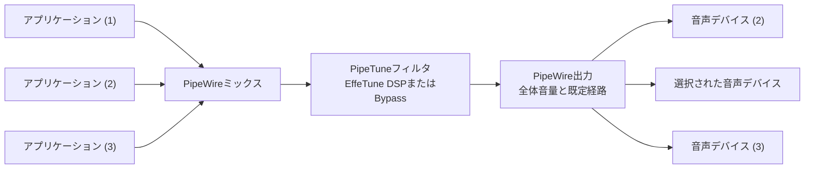

# PipeTune

EffeTune DSPをLinuxデスクトップに適用するエンジンとユーザーインターフェイス


[](https://www.repostatus.org/#active)
[](https://opensource.org/licenses/MIT)

----

[(English language is here)](./README.md)

## これは何?

PipeTuneは、Linuxのデスクトップセッションの音声に
[EffeTune](https://github.com/Frieve-A/effetune) で構築したDSPプリセットを適用します。

WirePlumber (PipeWireオーケストレーター) が、アプリケーション音声をミックスした後の通常の再生経路へ
PipeTuneを透過フィルタとして挿入します。

EffeTune DSPは完全ネイティブコンパイルされたバイナリで計算を行います。
各プラットフォームで、ネイティブSIMD演算を選択出来ます。

また、デスクトップのシステムトレイに
常駐するGTK3コントロールアプリケーションを提供します。


### 機能

- EffeTuneのプリセットファイルを読み込んで、Linuxシステム全体の音声出力に
  DSPパイプラインを適用できます。
- `.effetune_preset`拡張子の標準形式および旧形式のEffeTuneプリセットファイルを
  読み込み、DSPパイプラインをデスクトップ音声へ適用します。
- PipeWireグラフとのサンプリング周波数の自動交渉、または44.1、48、96、192、384 kHzの指定周波数でDSPを計算します。
- DSPは完全ネイティブコードで計算を処理します。互換性重視のScalar、SIMD自動選択、CPU検証済みの命令セット別実装を選択出来ます。
- システムトレイに常駐するGTKアプリケーションで、様々なDSPの状態と設定を行えます。
- CLIコマンドでも操作が可能です。

### 対応システム

PipeTuneには、WirePlumberが管理するPipeWireデスクトップセッションと
systemdユーザーサービスが必要です。WirePlumber 0.4と0.5に対応します。

> 注釈: 標準ディストリビューションのDebian及びUbuntuが該当します。
> 他のディストリビューションでも環境を満たせば動作する可能性はあります。

ビルド済みDebianパッケージは、次の環境向けに公開しています。

| ディストリビューション | リリース | アーキテクチャ |
| :--- | :--- | :--- |
| Debian | bookworm | amd64, i386, arm64, armhf |
| Debian | trixie | amd64, i386, arm64, armhf, riscv64 |
| Ubuntu | 24.04 | amd64, arm64 |
| Ubuntu | 26.04 | amd64, arm64 |

---

## ダウンロードとインストール

[PipeTuneのGitHub Releasesページ](https://github.com/kekyo/pipetune/releases/) から、
使用するディストリビューション、リリース、アーキテクチャに合う`.deb`をダウンロードしてください。

ダウンロードするパッケージのアーキテクチャが分からない場合は、次のコマンドで
確認出来ます。

```sh
dpkg --print-architecture
```

ダウンロードしたパッケージがあるディレクトリでターミナルを開きます。
そのディレクトリに対象のPipeTuneパッケージだけがあることを確認して、次のコマンドでインストールします。

```sh
sudo apt install ./pipetune-*.deb
```

`apt`は、パッケージと必要なランタイム依存関係をインストールします。

インストール出来たかどうかは、以下のコマンドで確認出来ます:

```sh
pipetune --version
```

## 初期設定

PipeTuneはユーザーレベルデーモンとして動作するため、パッケージのインストール後に
デスクトップユーザー毎のセットアップが一度必要です。GNOMEランチャーのPipeTune
アイコンをダブルクリックするか、他のデスクトップのアプリケーションメニューから
PipeTuneを起動すると、GTKアプリケーションがデーモンへ接続する前にこのセットアップを
自動実行します。以前に別のユーザーがパッケージをインストールし、現在のユーザーが
初めてPipeTuneを起動する場合も同様です。

同じセットアップを明示的に行う場合は、`sudo`を付けずに、デスクトップを使用する
一般ユーザーとして次のコマンドを実行します。

```sh
pipetune setup
```

`setup`は、現在のユーザーの管理ファイル、セットアップバージョン、systemdユーザー
サービスを確認します。既に最新の状態ならセットアップ処理を繰り返さず終了します。
必要な場合はインストールまたは修復を行い、PipeTune GTKアプリケーションを
システムトレイに常駐させます。セットアップ処理を無条件に再実行する場合は、
`pipetune setup --force`（または`pipetune setup -f`）を使用します。

初回起動の自動セットアップ中は進捗が表示され、操作項目は読み取り専用になります。
セットアップに失敗した場合は、PipeTune GTKが診断内容をAction Logに表示し、
ウィンドウが非表示ならデスクトップ通知も送信します。既に動作しているデーモンを
利用できるように、その後も接続を試みます。


システムトレイアイコンをダブルクリックするか、あるいはメニューから"Open"を選択することで、PipeTune設定ウインドウを表示出来ます。

## PipeTune設定ウインドウ

PipeTune設定ウインドウは、左側のセクション分けされたPipeTuneステータスを常に表示し、
右側でProcessing、Rate、DSP、Advancedの設定を切り替えます。


設定を変更すると、動作中のデーモンへ直ちにプレビュー反映されます。
`Apply` ボタンは、その状態を確定して保存します。
`Cancel` ボタン、Escape、またはタイトルバーの閉じるボタンは、
以前のライブ状態へ戻してからウィンドウを隠します。

左側のステータスパネルには、DSPの使用率がバーで表示されます。
下部の `Action Log` ドロワーでは、接続、プレビュー、保存、失敗の履歴を参照出来ます。

`Processing` の `Enable DSP processing` スイッチを使用して、DSPのオン・オフを簡単に切り替えられます（Bypassモード）。

なお、PipeTuneデーモンとの接続が行えない場合は、UI要素が読み取り専用になり、再接続後に処理を再開します。

## 音声ストリームとPipeTune

PipeTuneは、Linux PipeWireとWirePlumberを使用して、DSP計算をフィルタとして音声ストリームに挿入します。以下にこの様子を示します:



各アプリケーション別の音量は、ミックス前に適用されます。
BypassモードではEffeTuneを呼び出さず、ミックス済みPCMをそのまま後段へ渡します。
DSPフィルタの後では、デスクトップの全体音量と出力デバイス選択がPipeTuneを使用しない場合と同じように動作します。

## EffeTune DSPプリセット選択

EffeTune DSPプリセットをPipeTuneにロードする場合、以下のファイルを選択出来ます:

- EffeTune標準のDSPプリセット群
- EffeTune (Linux AppImage版)で保存されたユーザープリセット群
- 個別の `*.effetune_preset` ファイル

このうち、Linux AppImageで保存されるユーザープリセットファイルは `$XDG_CONFIG_HOME/effetune/effetune_presets.json`
（あるいは `~/.config/effetune/effetune_presets.json`）に存在します。

リストからプリセットを選択するかファイルを指定すると、DSPへ直ちにライブプレビューされます。

プリセット処理中は、PipeTuneがDSPで使用中のファイルを監視します。
ファイルの直接編集またはアトミックな置換を検出すると、自動的に再ロードします。
新しいパイプラインは適用前に最後まで構築され、読み込み、解析、DSP構築のいずれかが失敗した場合は、
現在動作中の古いパイプラインを維持して状態表示へエラーを通知します。
その後ファイルが正常な内容へ修復されると、自動的に再試行します。
EffeTuneで保存したプリセットを使用中の場合は、設定アプリケーションが該当項目の変更を
専用スナップショットへ反映し、同じデーモン側の再ロードを起動します。

CLIでは、プリセットファイルのパスを指定するか、またはバイパスモードを指定することが出来ます。

```sh
pipetune setup --preset /absolute/path/to/example.effetune_preset
pipetune bypass
```

## PCM周波数の選択

PipeTune設定ウインドウの `DSPサンプリング周波数` と `PipeWire強制方式` から設定出来ます。
`Automatic` は、PipeWireグラフと交渉された周波数に追従します。
固定値では、 `44.1`, `48`, `96`, `192`, `384` kHzのいずれかをフィルタの両ノードとEffeTuneエンジンへ要求します。
状態表示には、実際のDSP周波数とグラフ周波数が表示されます。

- `Suggest` は、グラフ周波数をPipeWireに提案します。PipeWireはその周波数を受け入れるか、あるいは音声ストリームの都合に合わせて異なるグラフ周波数を選ぶ場合があります。
- `Force` はさらに、その周波数を維持するようPipeWireへ要求します。

どちらもPipeWire全体のグローバルクロック設定は変更しません。

要求値を適用できない場合もPipeTuneは切断せず、実際に交渉されたグラフ周波数でDSPを継続します。
`Force` の不成立はRate診断に表示されます。

CLIでは、同じ情報の表示と設定を次のコマンドで行えます。

```sh
pipetune rate list
pipetune rate get
pipetune rate set automatic
pipetune rate set 192000 force
```

`rate list` は、 `Automatic` と5つの固定周波数を表示します。
`rate get`は、設定済みポリシーと交渉された周波数を表示します。
デーモン接続中の `rate set` は直ちに切り替え、デーモンが成功を確定した後でのみ設定を保存します。
デーモンが利用できない場合は、次回起動用として保存します。

周波数の切り替え中は、DSPとPipeWireストリームを再構築するため、短い無音区間が発生する場合があります。

## ネイティブDSPバックエンドの選択

PipeTuneは、EffeTune DSPをどのCPU命令セットを使用して計算するかを選択出来ます。
これは、PipeTune設定ウインドウの `DSP` ページにある `Native backend` から選択します。

- `Scalar` は、EffeTuneとの互換性重視の既定値です。出来る限り忠実にEffeTuneと同じ計算を行う前提で動作します。
- `SIMD (Auto)` は、CPUが対応し検証に通った最上位の実装を自動選択します。
- 同じドロップダウンから、対象アーキテクチャで利用できる `baseline`, `x86-64-v3`, `x86-64-v4`, `Arm64 SVE` を固定することも出来ます。

> 注釈: オリジナルのEffeTuneは、計算をWebAssembly/WebAssembly SIMDで行いますが、PipeTuneはCPUネイティブ命令で計算します。
> 従って、非常に細部の計算結果がEffeTuneと異なる可能性があることに注意して下さい。
> （プロジェクトのオーナーはこれを聞き分けることが出来ませんでした）

CLIでは、同じ情報の表示と設定を次のコマンドで行えます。

```sh
pipetune dsp list
pipetune dsp get
pipetune dsp set scalar
pipetune dsp set simd
pipetune dsp set simd --variant x86-64-v3
```

デーモン接続中の `dsp set` は、現在のプリセットパイプラインを新しいバックエンドで再構築し、
デーモンが成功を確定した後でのみ設定を保存します。

DSP内部状態はリセットされるため、切り替え時の不連続や短い無音は許容されます。
デーモンが利用できない場合は、ローカル検証に通った選択を次回起動用に保存します。
起動時にSIMDのCPU要件またはライブラリ検証を満たせない場合は、
利用可能な下位SIMDまたはScalarへフォールバックし、実際のバリアントと理由を状態表示に残します。

## PipeTune設定のリセット

PipeTune設定ウインドウの `Advanced` ページにある `Restore Defaults` は、
次の状態をライブプレビューします。この時点では保存しません。

- DSPはBypassモードに変更
- PCM周波数は `Automatic` 、PipeWire要求は `Suggest`
- ネイティブDSPバックエンドは `Scalar`

`Apply` で既定値を保存し、 `Cancel` で以前のライブ設定へ戻せます。
なお、このGTK操作はサービスを再起動しません。

設定リセットは、CLIでも使用出来ます。

```sh
pipetune config reset
pipetune config reset --yes
```

`--yes`（または`-y`）を付けない場合は確認を求めます。
設定ファイルは完全に置き換えられるため、設定ファイルの破損状態からの復旧にも使用出来ます。

実行中のユーザーサービスは直ちに再起動し、停止中のサービスは停止したままです。

## PipeTuneの更新と削除

PipeTuneを更新するには、 [GitHub Releases](https://github.com/kekyo/pipetune/releases/)
から新しい対応パッケージをダウンロードし、同じ`sudo apt install ./pipetune-*.deb`コマンドでインストールします。

その後、デスクトップのアプリケーションメニューからPipeTuneを起動します。
セットアップバージョンの更新を検出し、必要なユーザー毎の変更を自動適用します。
一般ユーザーとして`pipetune setup`を実行しても同じ処理を行えます。

パッケージを削除する前に、デスクトップを使用する一般ユーザーとしてユーザーごとの設定を解除して下さい。

```sh
pipetune unsetup
sudo apt remove pipetune
```

`pipetune unsetup` はGTKアプリケーションを終了し、ユーザーサービスを無効化・停止し、WirePlumberの構成を解除します。
また、GTKアプリケーションが自動起動しないように、ユーザー用の自動起動マスクを作成します。
起動時のプリセット選択は保持されます。

PipeTuneのアプリケーション設定も削除する場合は、`pipetune unsetup --purge`を使用します。

## ログ

デーモンのログは次のコマンドで確認出来ます。

```sh
journalctl --user -u pipetune.service
```

---

## 関連情報

- [デーモンの操作方法と開発者向けドキュメント (英語)](pipetune/README.md)
- [GTKアプリケーションの動作 (英語)](pipetune-gtk/README.md)
- [ネイティブDSPバックエンドとベンチマーク (英語)](pipetune/docs/dsp-backends.md)

## 制約

現在のバージョンでは、FIR Crossover、5Band FIR PEQ、Group Delay EQ、Room EQ、
IR Reverbは使用できません。これらのDSPに必要な畳み込みアセットはEffeTuneによって
別途生成または保存され、`.effetune_preset`ファイルには含まれないため、PipeTuneから
読み込むことができません。

## ライセンス

Under MIT.
