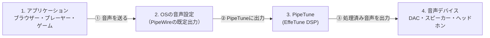

# PipeTune

Linuxのデスクトップセッションの音声に、EffeTuneで構築したDSPプリセットを適用


----

[(English language is here)](./README.md)

## これは何?

PipeTuneは、Linuxのデスクトップセッションの音声に
[EffeTune](https://github.com/Frieve-A/effetune) で構築したDSPプリセットを適用します。

選択した音声出力デバイスの手前に、仮想PipeWireシンクを挿入して実現します。
また、デスクトップのシステムトレイに常駐するGTK 3コントロールアプリケーションを提供します。

### 機能

- `.effetune_preset`拡張子の標準形式および旧形式のEffeTuneプリセットファイルを
  読み込みます。
- 有効なEffeTuneネイティブDSPパイプラインをデスクトップ音声へ適用します。
- CLIまたはGTKアプリケーションから物理出力を選択できます。
- 指定した出力が利用できない間は物理的なシステム既定へフォールバックし、
  再接続後は指定した出力へ自動復帰します。
- デーモンを再起動せずにプリセットを変更できます。
- プリセットが未選択の場合は、安全なパススルーモードで起動します。
- CLIコマンド1つで、ユーザーごとの設定または解除を行えます。
- GTKアプリケーションに実行状態と音声エラーカウンターを表示します。
- PipeTuneの停止時に、既定の出力を物理出力へ戻します。

既定のストリーム形式は48 kHzステレオです。異なる形式を使用するアプリケーションの
ストリームはPipeWireが変換します。

### 対応システム

PipeTuneには、PipeWireデスクトップセッションとsystemdユーザーサービスが必要です。
単独のPulseAudioセッションには対応していません。

ビルド済みDebianパッケージは、次の環境向けに公開しています。

| ディストリビューション | リリース | アーキテクチャ |
| --- | --- | --- |
| Debian | bookworm | amd64, i386, arm64, armhf |
| Debian | trixie | amd64, i386, arm64, armhf, riscv64 |
| Ubuntu | 24.04 | amd64, arm64 |
| Ubuntu | 26.04 | amd64, arm64 |

ダウンロードするパッケージのアーキテクチャが分からない場合は、次のコマンドで
確認できます。

```sh
dpkg --print-architecture
```

---

## ダウンロードとインストール

[PipeTuneのGitHub Releasesページ](https://github.com/kekyo/pipetune/releases/) から、
使用するディストリビューション、リリース、アーキテクチャに合う`.deb`をダウンロードしてください。

ダウンロードしたパッケージがあるディレクトリでターミナルを開きます。
そのディレクトリに対象のPipeTuneパッケージだけがあることを確認して、次のコマンドでインストールします。

```sh
sudo apt install ./pipetune-*.deb
```

`apt`は、パッケージと必要なランタイム依存関係をインストールします。

インストール出来たかどうかは、以下のコマンドで確認出来ます:

```sh
pipetune --version
```

## 初期設定

PipeTuneはユーザーレベルデーモンとして動作するため、パッケージのインストール後にユーザー毎に個別の追加セットアップが必要です。

`sudo` を付けずに、デスクトップを使用する一般ユーザーとしてsetupを実行します。

```sh
pipetune setup
```

`setup` はsystemdユーザーサービスを再読み込み、有効化、再起動し、アクティブ状態を確認してからPipeTune GTKアプリケーションをシステムトレイに常駐させます。


以降は自動的にシステムトレイに表示されます。

## 音声ストリームとPipeTune

PipeTuneは、ユーザーセッションの仮想的な出力デバイスとなり、EffeTuneのプリセット定義によってDSP計算を行って出力します。
これを図で簡単に示すと、以下のような流れとなります:



- ②で音声ストリームをPipeTuneに出力する必要があります。
  これは、OSの音声出力デバイスの設定ダイアログなどで指定して下さい。
- 音声ストリームの③では、ユーザーが指定した音声デバイスが利用可能なら、そのデバイスへ出力します。
  指定したデバイスが見つからない間（例えばUSBデバイスが抜けている）は、システム既定へ自動的にフォールバックし、
  再接続されると指定デバイスへ自動復帰します。

## PipeTuneからどのデバイスに出力するか

前節の③は、ユーザーが明示的にデバイスを指定できます。


GTKウィンドウの**Output preference**ドロップダウンから出力を選択できます。
先頭の**System default**を選ぶと、明示的な指定を破棄します。
また、実際の出力先と、指定デバイス・システム既定・フォールバックのどの理由で選択されたかを表示します。

CLIでは同じ操作を次のコマンドで行えます。

```sh
pipetune output list
pipetune output get
pipetune output select
pipetune output set alsa_output.example
pipetune output clear
```

これらのコマンドを使うには、ユーザー用デーモンが動作している必要があります。
`output select`は対話可能なターミナルに番号付きメニューを表示します。
`output set`は安定したPipeWireの`node.name`を保存するため、一時的に切断されている
デバイスも指定できます。`output clear`はその指定を破棄します。

明示的な指定がなければ、物理的なシステム既定のデバイスへ出力します。
音声出力が1台も存在しない場合もデーモンは終了せず、デバイスの接続を監視しますが、
デバイスが現れるまで音声は再生されません。

## EffeTune DSPプリセット選択

EffeTune DSPプリセットをPipeTuneにロードする場合、以下のファイルを選択できます:

- EffeTune標準のDSPプリセット群
- EffeTune (Linux AppImage版)で保存されたユーザープリセット群
- 個別の `*.effetune_preset` ファイル

このうち、Linux AppImageで保存されるユーザープリセットファイルは `$XDG_CONFIG_HOME/effetune/effetune_presets.json`
（あるいは `~/.config/effetune/effetune_presets.json`）に存在します。

リストからプリセットを選択するか、ファイルを指定して
`Apply and Save` ボタンをクリックすると、指定されたプリセットファイルをDSPにロードして、EffeTune DSPエンジンが計算を開始します。
`Bypass and Save` ボタンは、プリセットファイルを無視してDSP処理を行わずに、音声ストリームをバイパスします。

CLIでは、プリセットファイルのパスを指定するか、またはバイパスモードを指定することが出来ます。

```sh
pipetune setup --preset /absolute/path/to/example.effetune_preset
pipetune bypass
```

## PipeTuneの更新と削除

PipeTuneを更新するには、
[GitHub Releases](https://github.com/kekyo/pipetune/releases/) から新しい対応パッケージを
ダウンロードし、同じ`sudo apt install ./pipetune-*.deb`コマンドでインストールします。
その後、デスクトップを使用する一般ユーザーとして`pipetune setup`を実行します。

パッケージを削除する前に、デスクトップを使用する一般ユーザーとしてユーザーごとの
設定を解除します。

```sh
pipetune unsetup
sudo apt remove pipetune
```

`unsetup`はGTKアプリケーションを終了し、ユーザーサービスを無効化・停止し、
既定の出力を物理出力へ戻します。また、GTKアプリケーションが自動起動しないよう
ユーザー用の自動起動マスクを作成します。起動時のプリセット選択は保持されます。
PipeTuneのアプリケーション設定も削除する場合は、`pipetune unsetup --purge`を
使用します。

独自のユーザー用自動起動エントリーをマスクする必要がある場合、`unsetup`は
PipeTune管理のバックアップとして保存します。後で`pipetune setup`を実行すると、
そのバックアップを上書きせずに復元します。パッケージの削除だけでは、
ユーザーごとの設定や自動起動オーバーライドは削除されません。

## ログと復旧

デーモンのログは次のコマンドで確認できます。

```sh
journalctl --user -u pipetune.service
```

手動で起動したPipeTuneプロセスが、既定の出力を物理出力へ戻さないまま終了した場合は、
次のコマンドで復旧します。

```sh
pipetune --restore-default
```

---

## 関連情報

- [デーモンの操作方法と開発者向けドキュメント (英語)](pipetune/README.md)
- [GTKアプリケーションの動作 (英語)](pipetune-gtk/README.md)

## ライセンス

Under MIT.
